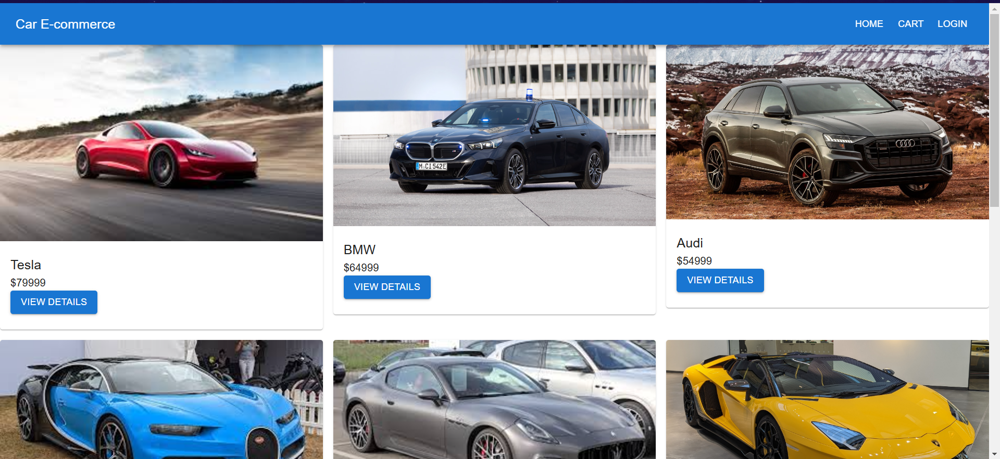
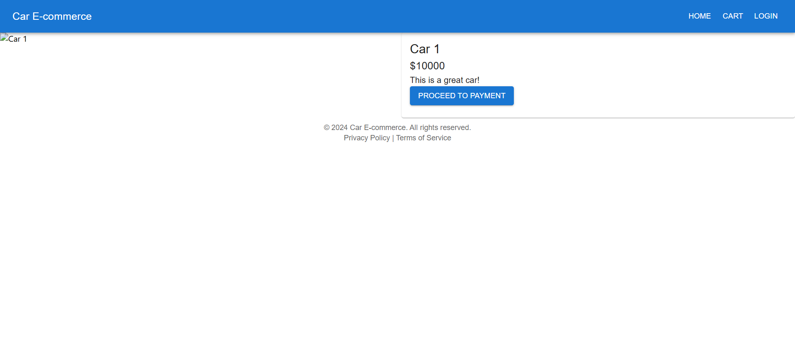
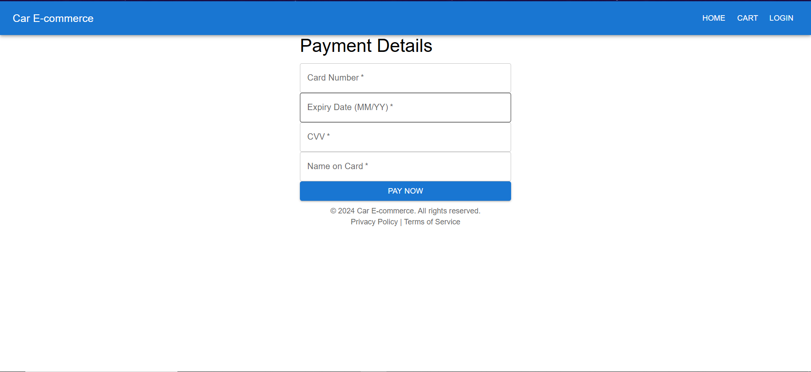
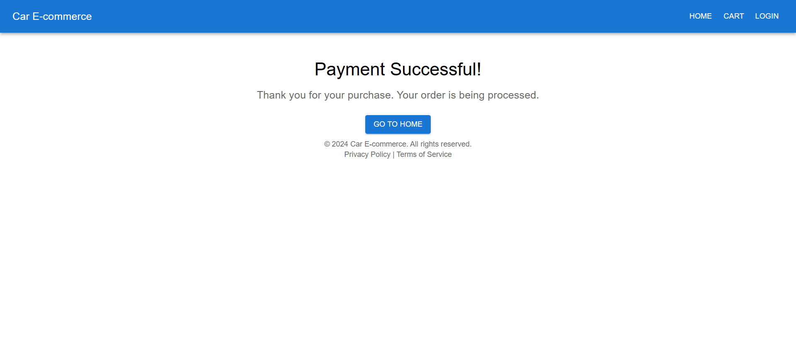

# 🚗 Car E-commerce App

A modern, responsive **ReactJS** web application designed for car rentals and sales. This application provides an interactive and seamless user experience, complete with product listings, detailed product pages, a payment flow, and a payment success confirmation.

---

## 🖼️ Screenshots

### **Home Page**

### **Product Page**

### **Payment Page**

### **Payment Success Page**

---

## 🎯 Features

- **Responsive Design**: Fully functional across devices (desktop, tablet, and mobile).
- **Dynamic Product Pages**: Each car has its own detailed page with images, price, and description.
- **Seamless Payment Flow**: Users can securely enter payment details and receive confirmation upon successful payment.
- **Reusability**: Modular and reusable components for consistent UI/UX.

---

## 🛠️ Tech Stack

- **ReactJS**: Frontend framework for building UI components.
- **Material-UI**: For modern and responsive UI components.
- **React Router DOM**: For navigation and routing.

---
